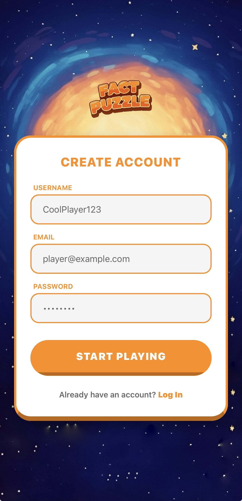
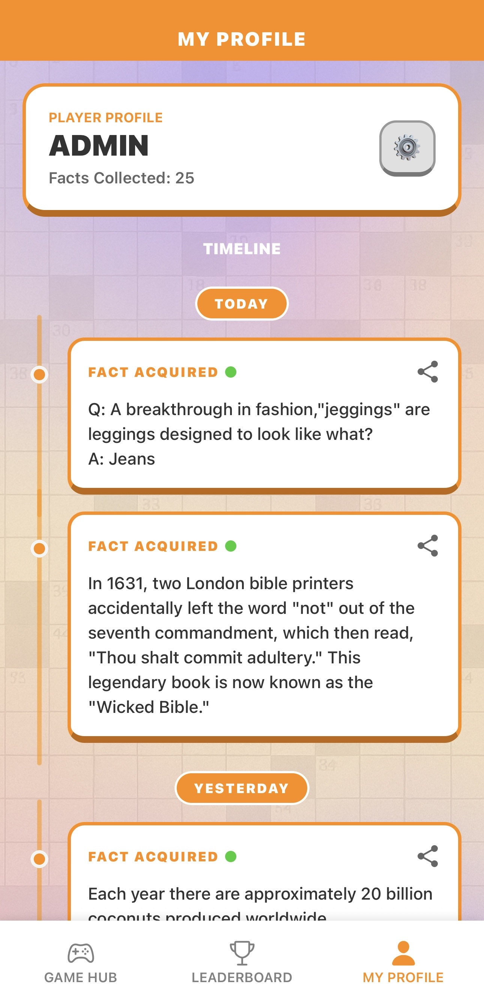
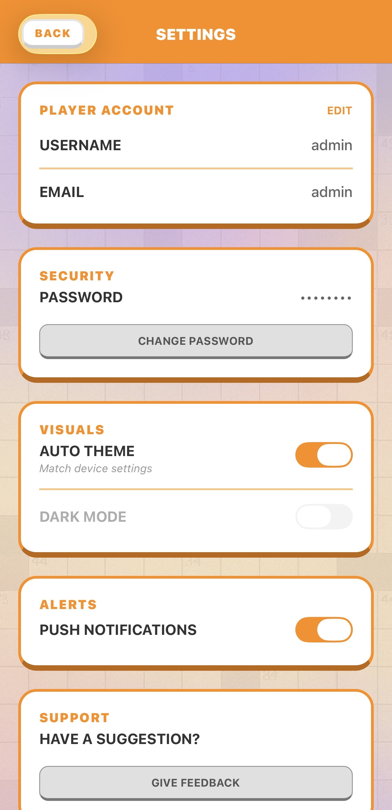
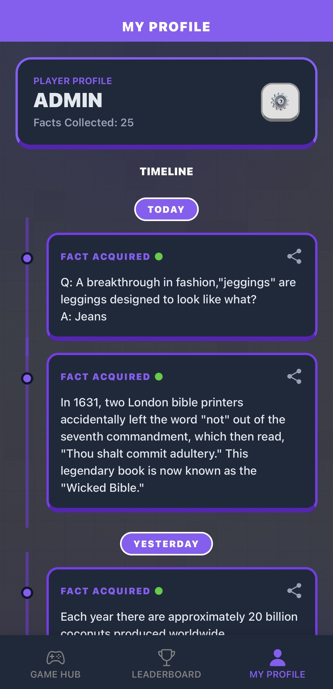

FactPuzzle — Gamified Knowledge Collection
Student Name: Mohamed Nawish Abdul Malik
Module: Mobile Applications (UFCF7H-15-3)
1. Project Overview
FactPuzzle is an interactive mobile application built using React Native (Expo) that blends logic-based puzzle games with educational content. Users solve games (Word Finder, Hangman, Trivia, Tic-Tac-Toe) to unlock interesting facts, which are saved to their personal timeline.
The app features:
A custom 3D-style aesthetic
Dark mode support
A local SQLite backend
A responsive UI for Android, iOS, and Web
2. Technologies Used
Frontend
React Native (Expo SDK 54)
React Navigation v7 (Native Stack, Bottom Tabs)
Context API (AuthContext, ThemeContext)
Axios with interceptors (offline detection)
Backend
Node.js (Express)
SQLite3
Async Storage (session persistence)
APIs
API-Ninjas: Facts, Dictionary, Trivia, Random Word
UI & Design
Custom 3D components
Dynamic theming (Light/Dark/System)
3. Installation & Running the Project
FactPuzzle uses a local Node.js server for database operations.
Both the server and the mobile app must be running.
Prerequisites
Node.js installed
Expo Go installed on your phone
Phone & PC on the same Wi-Fi network
Step 1 — Install Dependencies
npm install
Step 2 — Setup Backend Server
cd fact-puzzle-server
npm install
Step 3 — Run App + Server Together
A concurrent script is already configured:
npm run dev
This starts:
Express/SQLite server → Port 3000
Expo bundler
Step 4 — Connect Your Phone
Open the Expo Go app and scan the QR code.
IP auto-detected using expo-constants
No manual configuration required
Ensure firewall allows Port 3000
4. Feature List
🎮 Game Hub
Word Finder — dynamic word grid, 3 difficulty levels, diagonal selection, dictionary-powered hints
Hangman — animated stick figure, offline fallback mode
Trivia Challenge — answer-typing Q&A with fact rewards
Tic-Tac-Toe — CPU (Minimax “unbeatable” mode) & 2-Player mode
👤 User Profile & Timeline
Saved fact collection system
Facts grouped by date (Today, Yesterday, Previous)
Social sharing with branded image generation
⚙️ Settings & Customization
Full light/dark mode
Account editing (username, email, password)
Feedback submission stored in the DB
5. Screen Previews
Login & Sign Up
 
Game Hub (Light & Dark)
 
Profile & Sharing
 
Leaderboard & Settings
 
Dark Mode Variations
 
6. Known Issues & Future Improvements
Known Issues
Web limitation: “Share Image” disabled on Web due to browser restrictions on native view capture
Keyboard overlap: Keyboard may overlap inputs in Trivia on small screens despite KeyboardAvoidingView
Future Improvements
Cloud Migration: Move SQLite to Firebase/Supabase for global login support
Push Notifications: Daily puzzle reminders
Avatar Customization: Upload or choose profile avatars
7. Submission Checklist
Fully working Android/iOS/Web application
Working navigation, Context API, SQLite persistence
Includes Public API usage (API-Ninjas)
Code submitted via GitHub
README includes screenshots + setup instructions