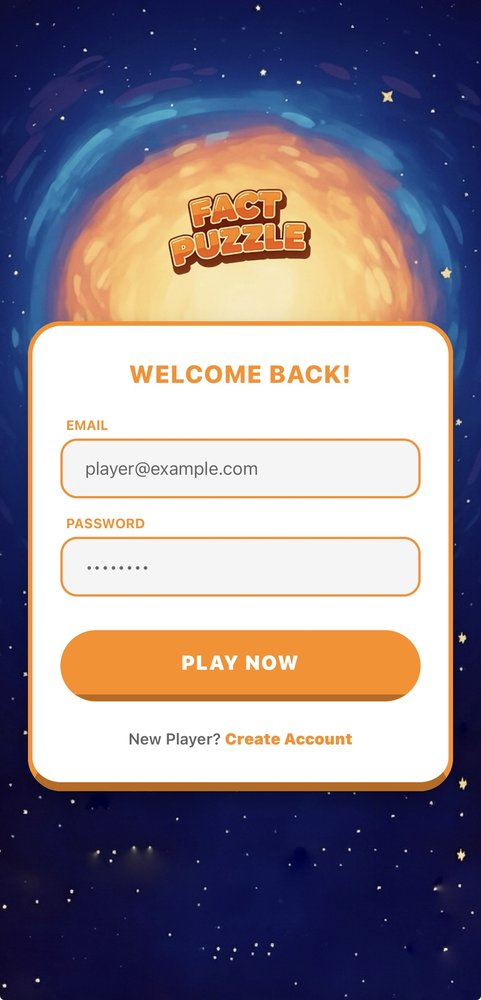
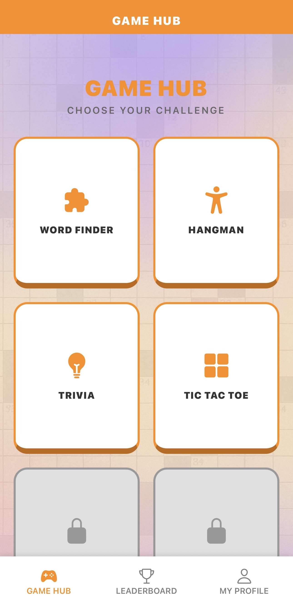
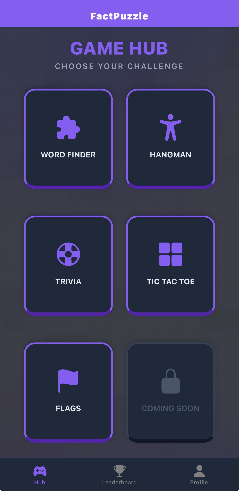
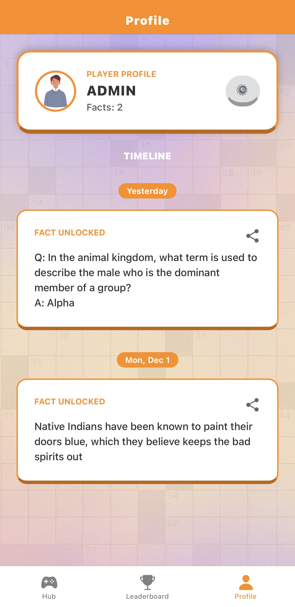
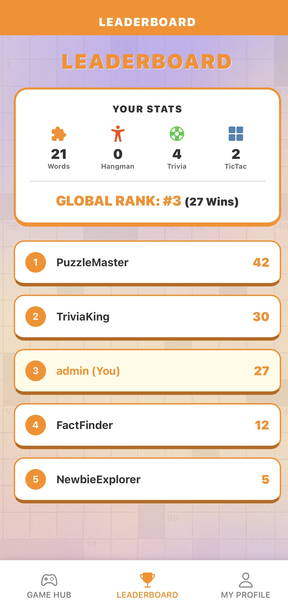
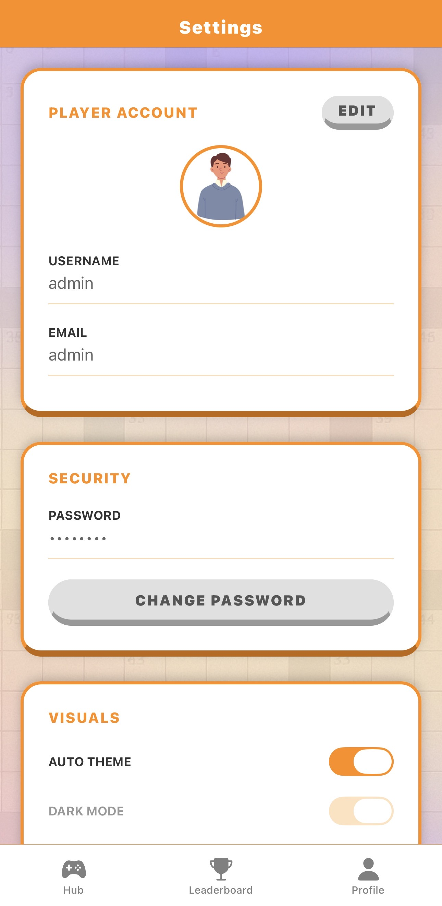
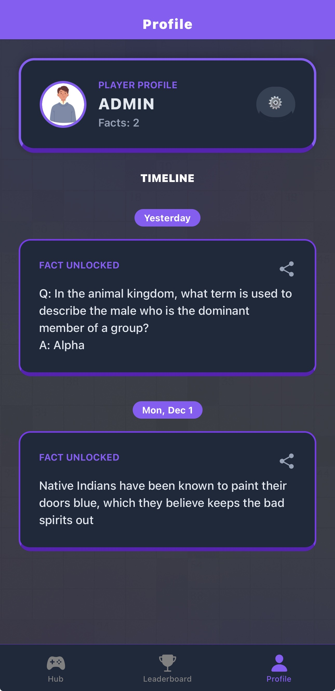
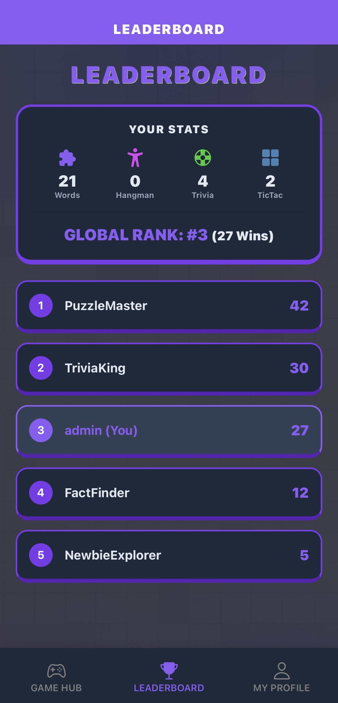

FactPuzzle — Gamified Knowledge Collection

Student Name: Mohamed Nawish Abdul Malik
Module: Mobile Applications (UFCF7H-15-3)

1. Project Overview
FactPuzzle is an interactive mobile application built with React Native (Expo) that combines logic puzzle games with educational content. The core loop of the application involves solving games (Word Finder, Hangman, Trivia, Tic-Tac-Toe) to "unlock" interesting facts. These facts are collected and stored in the user's profile timeline.

The app features a custom "3D Game" aesthetic, full dark mode support, a persistent local SQLite backend database, and a responsive layout that works on both Mobile (Android/iOS) and Web.

2. Technologies Used
Frontend Framework: React Native (Expo SDK 54)
Navigation: React Navigation v7 (Native Stack & Bottom Tabs)
State Management: React Context API (AuthContext & ThemeContext)
Backend: Node.js (Express) with SQLite3
Persistence: Async Storage (Session handling) & SQLite (Data storage)
Networking: Axios (with Interceptors for Offline Detection)
External APIs: API-Ninjas (Facts, Dictionary, Trivia, Random Word)
UI/Design: Custom 3D-styled components, Dynamic Theming (Light/Dark/System)
3. Installation & Run Instructions
This project uses a Local Node.js Server for the database. Both the server and the app must be running for the application to function.

Prerequisites
Node.js installed on your machine.
Expo Go app installed on your mobile device.
Your computer and phone must be on the same Wi-Fi network.
Step 1: Install Dependencies
Open your terminal in the main project folder:

code
Bash
npm install
Step 2: Setup the Backend
Navigate to the server directory and install server dependencies:

code
Bash
cd fact-puzzle-server
npm install
Step 3: Run the Project
Return to the main project folder. I have configured a concurrent script to run both the server and the app simultaneously.

code
Bash
npm run dev
This command starts the Node.js/SQLite server on Port 3000 and the Expo Bundler.

Step 4: Connection
Scan the QR code with Expo Go.

Automatic IP Configuration: The app uses expo-constants to automatically detect your computer's IP address. You do not need to manually configure the IP in the code, provided your firewall allows connections on Port 3000.
4. Feature List

🎮 Game Hub
Word Finder: A grid-based puzzle game with 3 difficulty levels (Easy, Medium, Hard). Includes dynamic word placement, diagonal selection, and a hint system powered by a Dictionary API.
Hangman: Classic word guessing game with a custom-drawn stick figure animation and an offline fallback mode if the API fails.
Trivia Challenge: A Q&A game where users type answers to receive fact rewards.
Tic-Tac-Toe: Includes a "Play vs CPU" mode with an unbeatable Minimax algorithm (Hard mode) and a 2-Player Pass & Play mode.
👤 User Profile & Timeline
Fact Collection: When a puzzle is solved, the fact is saved to the user's database.
Timeline View: Saved facts are grouped by date (Today, Yesterday, Previous) in a visual timeline.
Social Sharing: Users can generate a branded image of their solved fact to share on social media.
⚙️ Settings & Customization
Dynamic Theming: Full support for Light Mode (Orange Theme) and Dark Mode (Neon/Space Theme). Can sync with System settings.
Account Management: Edit username/email and change password securely.
Feedback System: Users can submit feedback which is stored in the database.
5. Screen Previews
Login & Sign Up	Game Hub (Light & Dark)
 	 
Profile & Sharing	Leaderboard & Settings
 	 
Dark Mode Variations
 
6. Known Issues & Future Improvements

Known Issues
Web View Limitations: The "Share Image" feature is disabled on the Web version due to browser security limitations regarding native view capture (react-native-view-shot).
Keyboard Handling: On smaller devices, the keyboard may occasionally cover input fields in the Trivia game, though KeyboardAvoidingView is implemented to minimize this.
Future Improvements
Cloud Migration: Move the SQLite database to a cloud provider (like Firebase Firestore or Supabase) to allow users to log in from any network (e.g., 4G/5G) without needing to be on the same Wi-Fi as the host computer.
Push Notifications: Implement daily reminders to play a puzzle using Expo Notifications.
Avatar Customization: Allow users to upload profile pictures or select avatars for the leaderboard.
7. Submission Checklist

Fully working app (Android/iOS/Web).

Navigation, State Management (Context), Persistence (SQLite).

Public API Integration (API-Ninjas).

Codebase submitted via GitHub.

README with screenshots and setup instructions included.